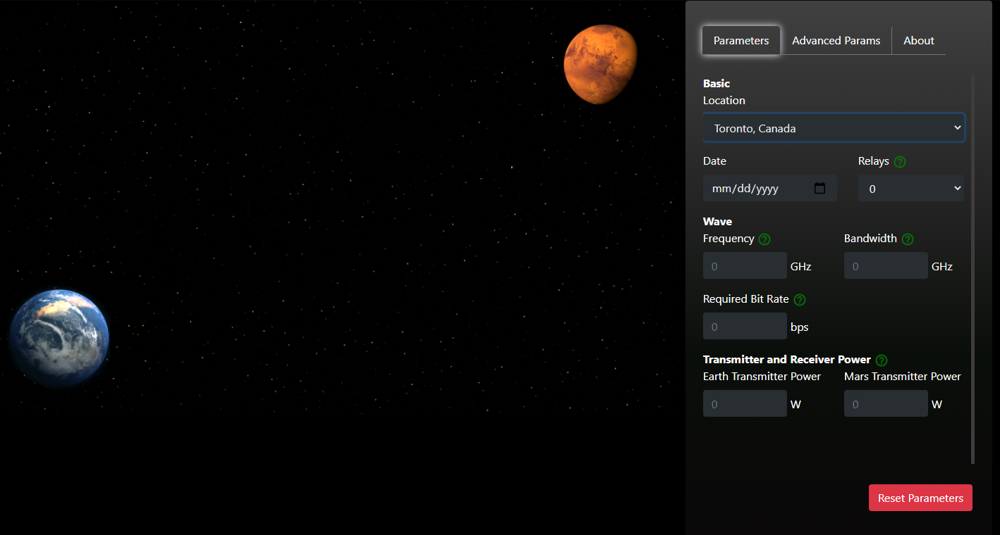

# LinkedUp
Since Neil Armstrong's first step on the moon, people have wondered when will we take out first step on Mars. We believe, we will go to Mars in the coming decades.
But what happens when we get there? How will we communicate back home? How will communicate over an average of 63 million kms?

LinkedUp allows us to explore this problem. It's a sandbox where people to play with different communication parameters for signals to and from Mars. 

LinkedUp features an intutive UI paired with live data and NASA handbooks to calulate singal transmission. Built on React and Node (Express), this project was made during the SpaceApps 2020 Hackathon.

## Installation 
 - Install [npm](https://www.npmjs.com/get-npm)

### Front End Installation
 - In your command line/terminal:
   - Navigate to ```3.14Heads-SpaceApps2020/3.14heads``` using ```cd```
   - ```npm install```


### Back End Installation
 - Install [Python](https://www.python.org/downloads/)
 - In your command line/terminal, use the following commands:
 ```
   pip numpy
   pip pyowm
   pip skyfield
```
   - Navigate to ```3.14Heads-SpaceApps2020/Backend``` using ```cd```
     - ```npm install```
###  Running the Tool
 - Navigate to ```3.14Heads-SpaceApps2020/Backend```
   - ```node server.js```
 - Navigate to ```3.14Heads-SpaceApps2020/3.14heads```
   - ```npm start```
 Once you've done all the above steps, the tool will be accessible at [localhost:3000](http://localhost:3000/) 

## Front-end
The view is broken into 4 major components
 ### The Space Map
  - It features a picture of Earth and Mars. When a message is sent it shows the signals between the two planets and also displays relays (satellites serve as intermediaries for communication).
 ### The Paramesters Dashboard
  - This displays the parameters that users can play with to modify the signal behaviour. It also features Advanced Parameters for advanced options and an about section.
 ### The Message Card
  - This contains a text area where users can type a message and send to Mars (similutate the singal based on the parameters previous defiend)
 ### The Results Card
  - This is where users can see the outcome of the message and parameter options.
 
 |  | 
 |:--:| 
 | *Left: The space map&nbsp;&nbsp;&nbsp;&nbsp;&nbsp;&nbsp;&nbsp;&nbsp;&nbsp;&nbsp;&nbsp;&nbsp;&nbsp;&nbsp;&nbsp;&nbsp;&nbsp;&nbsp;Right: The parameters dashboard* |
 |  |  
 | *Left: The message card&nbsp;&nbsp;&nbsp;&nbsp;&nbsp;&nbsp;&nbsp;&nbsp;&nbsp;&nbsp;&nbsp;&nbsp;&nbsp;&nbsp;&nbsp;&nbsp;&nbsp;&nbsp;Right: The results card* |
## Back-end
The backend relies on Node, Express, and Python. We used 

## Data
LinkUp uses uses data from a variety of APIs and databases; including CSA data

